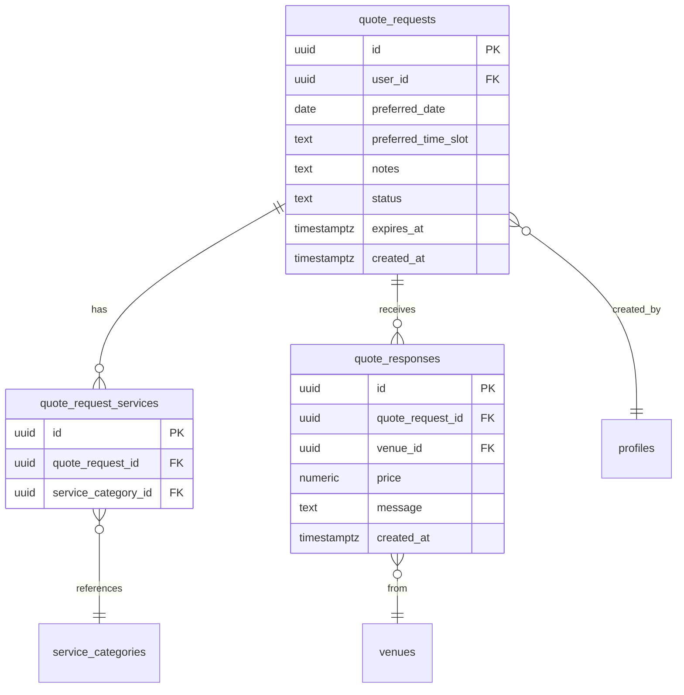
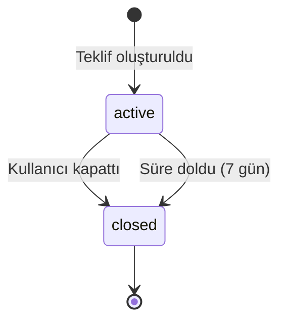

# Design: Teklif İsteme Özelliği

## Genel Bakış

Kullanıcıların işletmelerden fiyat teklifi isteyebilmesini sağlayan sistem. Kullanıcı birden fazla hizmet seçerek, tercih ettiği tarih ve saat dilimini belirterek teklif talebinde bulunabilir.

## Veritabanı Şeması



## Durum Akışı



## UI Akışı

### Teklif Oluşturma Stepper

```
┌─────────────────────────────────────────┐
│  ○ Hizmetler  → ○ Tarih → ○ Not → ○ Özet │
└─────────────────────────────────────────┘
```

**Adım 1 - Hizmet Seçimi:**
- Kategorilere göre gruplandırılmış liste
- Arama/filtreleme özelliği
- Çoklu seçim (chip/checkbox)
- Minimum 1 hizmet seçilmeli

**Adım 2 - Tarih ve Saat:**
- Tarih seçici (bugünden itibaren)
- Saat dilimi tercihi: Sabah (09-12), Öğle (12-15), Akşam (15-20), Farketmez

**Adım 3 - Ek Notlar:**
- Opsiyonel textarea
- Örnek: "Gelin makyajı için önerinizi bekliyorum"

**Adım 4 - Özet ve Gönder:**
- Seçilen hizmetlerin listesi
- Tarih ve saat bilgisi
- Not önizlemesi
- "Teklif İste" butonu

### Floating Action Button (Navbar)

```
┌─────────────────────────────────────────┐
│  🏠    🔍    [ ✉️ ]    🔔    👤         │
│              ↑ FAB                      │
└─────────────────────────────────────────┘
```

- Ortada yükseltilmiş circular button
- Primary gradient (pembe → gold)
- Teklif/fiyat ikonu (Icons.request_quote veya Icons.mail_outline)
- Tıklandığında QuoteRequestScreen açılır

### Tekliflerim Listesi

```
┌─────────────────────────────────────────┐
│ Tekliflerim                              │
├─────────────────────────────────────────┤
│ ┌─────────────────────────────────────┐ │
│ │ 🟢 YAYINDA              3 yanıt    │ │
│ │ Saç Kesimi, Fön, Makyaj            │ │
│ │ 📅 15 Ocak 2026 • Öğle             │ │
│ └─────────────────────────────────────┘ │
│ ┌─────────────────────────────────────┐ │
│ │ ⚫ KAPANDI              5 yanıt    │ │
│ │ Protez Tırnak                       │ │
│ │ 📅 10 Ocak 2026 • Akşam            │ │
│ └─────────────────────────────────────┘ │
└─────────────────────────────────────────┘
```

### Teklif Detay Sayfası

```
┌─────────────────────────────────────────┐
│ ← Teklif Detayı                         │
├─────────────────────────────────────────┤
│ Seçilen Hizmetler                       │
│ • Saç Kesimi (Kadın)                    │
│ • Fön                                   │
│ • Günlük Makyaj                         │
├─────────────────────────────────────────┤
│ 📅 15 Ocak 2026 • Öğle (12:00-15:00)   │
├─────────────────────────────────────────┤
│ 📝 Gelin makyajı için önerinizi...     │
├─────────────────────────────────────────┤
│ Gelen Teklifler (3)                     │
│ ┌─────────────────────────────────────┐ │
│ │ Rose Güzellik Salonu                │ │
│ │ ₺1.200                    ★ 4.8    │ │
│ │ "Size özel indirimli fiyat..."     │ │
│ └─────────────────────────────────────┘ │
├─────────────────────────────────────────┤
│        [ Teklifi Kapat ]                │
└─────────────────────────────────────────┘
```

## Tasarım Kararları

### 1. Neden Ayrı quote_request_services Tablosu?
Kullanıcı birden fazla hizmet seçebileceği için many-to-many ilişki gerekli. Bu tablo seçilen hizmetleri normalize eder.

### 2. Neden expires_at Alanı?
Teklifler 7 gün sonra otomatik kapanacak. Bu, işletmelerin güncel tekliflere odaklanmasını sağlar.

### 3. Bildirimimler?
- İşletme yanıt verdiğinde kullanıcıya push notification
- Mevcut `NotificationProvider` kullanılacak
- Notification tipi: `quote_response`

### 4. Auth Gerekliliği
Teklif oluşturmak için giriş zorunlu. `AuthGuard` widget'ı kullanılacak.

## Gelecek Geliştirmeler (Bu Scope Dışı)

1. İşletme paneli - teklifleri görme ve yanıtlama
2. Teklif karşılaştırma
3. İşletmeyi değerlendirme (teklif sonrası)
4. Lokasyon bazlı teklif (yakın işletmelere öncelik)
